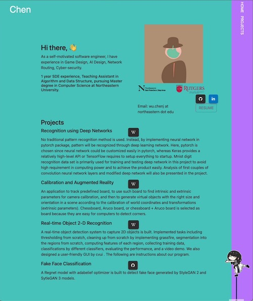

<!-- PROJECT LOGO -->

<h1 align="center">Chen's Home Page</h1>

###### Author: Chenjie Wu

###### Page: [suiboli314.github.io](https://suiboli314.github.io)

<!-- TABLE OF CONTENTS -->

  
Table of Contents

  <ul>
    <li><a href="#getting-started">Getting Started</a></li>
    <li><a href="#desgin-mockups">Desgin Mockups</a></li>
    <li><a href="#small-widget">Small Widget</a></li>
    <li><a href="#snapshot">SnapShot</a></li>
    <li><a href="#tech-requirements">Tech Requirements</a></li>
        <ul>
            <li><a href="#how-to-install">How to Instal</a></li>
        </ul>
    <li><a href="#snapshot">SnapShot</a></li>
    <li><a href="#thanks">Thanks</a></li>
  </ul>

## Getting Started

This repository hosts the [source code](./docs/index.html) for my [personal page](https://suiboli314.github.io).
It is a simple HTTP/CSS/JS page built with Bootstrap.
It provides some information about my career path,
experience, skills, projects, and an online resume.

### Design Mockups

The design credits for [@Onesway](https://www.onesway.design). 
To fit Bootstrap + vanilla javascript,
the design is remade and greatly simplified based on user persona and user stories.
See at [Figma](https://www.figma.com/file/uysordBubbygqyatIBVYRN/Untitled?node-id=0%3A1) (2 pages). 

### Small Widget

Greatly thanks to [@卜卜口](https://github.com/itorr/sakana) for the implementation of cute bobble-head widget.
The widget will be bouncing once page's loaded or interacted with the cursor. 
Image source:  [@大伏アオ](https://twitter.com/blue00f4) at [pixiv](https://pixiv.me/aoiroblue1340).

(<a href="#readme-top">back to top</a>)

### Tech Requirements

`Internet` and `Node.js` is required to build the page locally for the first time.

#### How to Install

- Clone the repo
- `npm install` install the required dependencies in repo folder

### Other Resources
- [presentation slides](./docs/assets/resources/Personal%20Homepage%20Presentation.pdf)
- [presentaton link](https://vimeo.com/754278032)
- [course link](https://johnguerra.co/classes/webDevelopment_fall_2022/)

### SnapShot

## Thanks

Thanks to prof. [John Guerra](https://johnguerra.co) and all the individuals mentioned before. 

(<a href="#readme-top">back to top</a>)

